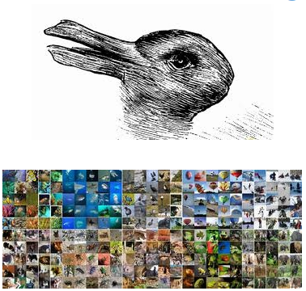
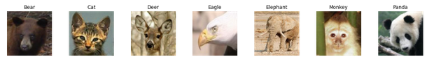

## **Classification d’images** 


Un ami enseignant vous explique qu'il souhaiterait utiliser une application de labellisation automatique d'images pour l'assister dans ses ateliers avec des enfants de maternelle. Au fil des années, il a accumulé de très nombreuses images d'animaux permettant d'évoquer différents thèmes tels que la jungle, la forêt, la ferme etc. Malheureusement ces images ne sont pas triés et représentent 500 Go de données sur un disque dur ! En tant que scientifique et remplis d'empathie, vous vous dites que vous ne pouvez pas laisser votre ami chercher pendant plusieurs heures les photos qui lui permettront d'appréhender sereinement le thème de la ferme le lendemain. L’idée soudaine vous vient de créer un algorithme de classification d’images qui lui permettrait par la suite de labelliser automatiquement ses magnifiques images. Enthousiaste par votre brillante idée, vous commencez par vous congratuler, puis lui promettez de revenir vers lui dans quelques jours avec le logiciel qui va révolutionner son emploi du temps en lui évitant de nombreuses heures de recherches dans ses données !

**Nous allons construire un modèle de base pour classer les images en fonction de leurs caractéristiques HOG. Ce projet va vous permettre de mettre en place des mécanismes d’automatisation de pipeline de données et de recherche de paramètres optimaux pour des modèles de classification. Cette méthodologie est générique et peut être appliquée à toutes sortes de problèmes d'apprentissage automatique.**

## **Références :**

* https://vcla.stat.ucla.edu/people/zhangzhang-si/HiT/exp5.html
* https://zestedesavoir.com/tutoriels/1760/un-peu-de-machine-learning-avec-les-svm/
* https://towardsdatascience.com/cat-or-dog-introduction-to-naive-bayes-c507f1a6d1a8
* https://kapernikov.com/tutorial-image-classification-with-scikit-learn/ (solution du brief)

1. Décompressez les données dans un dossier, qui sera le chemin source. Dataset : https://vcla.stat.ucla.edu/people/zhangzhang-si/HiT/AnimalFace.zip
2. Définissez une fonction pour lire, redimensionner et stocker les données dans un dictionnaire, contenant les images, les étiquettes (animal), les noms de fichiers originaux et une description. 

Les images elles-mêmes seront stockées sous forme de tableaux numpy contenant leurs valeurs RVB. Le dictionnaire sera enregistré dans un fichier pickle à l'aide de la librairie joblib. La structure des données sera basée sur celle utilisée pour les ensembles de données de test dans scikit-learn.

```
import joblib
from skimage.io import imread
from skimage.transform import resize
 
def resize_all(src, pklname, include, width=150, height=None):
    """
    load images from path, resize them and write them as arrays to a dictionary,
    together with labels and metadata. The dictionary is written to a pickle file
    named '{pklname}_{width}x{height}px.pkl'.
     
    Parameter
    ---------
    src: str
        path to data
    pklname: str
        path to output file
    width: int
        target width of the image in pixels
    include: set[str]
        set containing str
    """
 
    data = dict()
    data['description'] = 'resized ({0}x{1})animal images in rgb'.format(int(width), int(height))
    data['label'] = []
    data['filename'] = []
    data['data'] = []  
```
3. Créer le jeu de données en vous servant de votre fonction précédemment créée. Il y a pas mal d'animaux inclus dans le jeu de données, sélectionnez 8 classes d’animaux de votre choix. Nous définissons la largeur (et la hauteur) à 80 pixels.

4. Analysez le nouveau jeu de données fraîchement créé (nombre d’échantillons, les éléments “clés” des données, taille des images, labels des images).

5. Affichez un exemple de chaque animal inclus dans le jeu de données :

* Utilisez “np.unique” pour obtenir toutes les valeurs uniques dans la liste des étiquettes.
* Configurer la figure et les axes matplotlib, en fonction du nombre d'étiquettes.
* Faire un tracé pour chaque type d'étiquette. La méthode index renvoie l'index du premier élément correspondant à sa chaîne de recherche, label dans notre cas
Nous pourrions par exemple afficher ceci :



Par convention, nous nommons les données d'entrée X et le résultat (étiquettes / labels) y.
```
X = np.array(data['data'])
y = np.array(data['label'])
```

6. Diviser vos données en un ensemble de test et un ensemble de train avec la fonction train_test_split de scikit-learn (80% de l'ensemble total pour l'entraînement et le reste pour l'ensemble de test). Dans l'ensemble de données, les photos sont classées par animal, nous ne pouvons donc pas simplement diviser à 80%, (si les données sont ordonnées et que nous nous divisons à une certaine position, nous nous retrouverons avec certains animaux (types) apparaissant dans un seul des deux ensembles).
Nous pouvons résoudre ce problème en mélangeant les données avant de les fractionner. De cette façon, nous égalisons les distributions dans l'ensemble de train et de test et les rendons comparables. La fonction “train_test_split” de sklearn fournit un paramètre shuffle pour prendre en charge cela tout en effectuant le fractionnement. “Random_state” amorce le mélange pour qu'il soit aléatoire, mais de manière reproductible.

7. Vérifier que la distribution des photos dans l'ensemble de formation et de test est similaire, (examiner le nombre relatif de photos par catégorie).
Que pensez-vous des distributions ? Existe-t-il un moyen de s’assurer de l’obtention de distributions égales dans l'ensemble d'apprentissage et de test ?

8. Traitement des données:  Une approche classique de la reconnaissance d'objets est HOG-SVM, qui signifie Histogramme des dégradés orientés (Histogram of Oriented Gradients) et Support Vector Machines. Les HOG sont utilisés pour la réduction des caractéristiques, en d'autres termes : pour réduire la complexité du problème, tout en conservant autant de variations que possible. Pour calculer un HOG, une image est divisée en blocs, par exemple 8 par 8 pixels. Pour chacun de ces blocs, la magnitude du gradient dans un nombre donné de directions est calculée. Pour une explication détaillée, vous pouvez vous référer à ce tutoriel : http://www.learnopencv.com/histogram-of-oriented-gradients/.

Par exemple sur l’image ci-dessous, si l’on réduit l’image à un tier, puis que l’on calcule le HOG, on pourra renvoyer une représentation visuelle comme celle-ci :


Le nombre de points de données à traiter dans notre modèle a été réduit à ~ 15%, et avec un peu d'imagination, nous pouvons encore reconnaître un chien dans le HOG.

Les librairies utilisées pour obtenir le résultat ci-dessus sont les suivantes :

```
from skimage.feature import hog
from skimage.io import imread
from skimage.transform import rescale
```

Lors du calcul du HOG, nous effectuons une transformation. Nous pouvons transformer l'ensemble de notre ensemble de données à l'aide de transformateurs. Les transformateurs sont des objets qui se servent dans le tableau de données, transforment chaque élément et renvoient les données résultantes.

**Ici, nous devons convertir les images couleur en niveaux de gris, calculer leurs HOG et enfin mettre à l'échelle les données. Pour cela, nous utilisons trois transformateurs à la suite: RGB2GrayTransformer, HOGTransformer et StandardScaler. Le résultat final est un tableau avec un HOG pour chaque image de l'entrée.**

Scikit-learn est livré avec de nombreux transformateurs intégrés, tels qu'un StandardScaler pour mettre à l'échelle des entités et un Binarizer pour mapper des entités de chaîne à des entités numériques. De plus, il fournit les classes BaseEstimator et TransformerMixin pour faciliter la création de vos propres Transformers.

Un transformateur personnalisé peut être créé en héritant de ces deux classes (BaseEstimator, TransformerMixin) et en implémentant une méthode __init__, fit() et transform(). La classe TransformerMixin fournit la méthode fit_transform(), qui combine l'ajustement et la transformation que nous avons implémentés.

**Créer vos classes  RGB2GrayTransformer and HOGTransformer**
Après avoir instancié chaque transformateur (RGB2GrayTransformer(), HogTransformer(), StandardScaler()), mettez à l’échelle votre échantillon de données en appelant fit_transform() à chaque transformation en convertissant X_train étape par étape (RGB2GrayTransformer, puis HogTransformer, puis StandardScaler).

9. Entraîner un classifieur. Nous commencerons par Stochastic Gradient Descent (SGD), car il est rapide et fonctionne relativement bien.

10. Évaluer les faux positifs grâce à une matrice de confusion.

11. Mettre en place un pipeline qui pré-traite les données (RGB2GrayTransformer(), HogTransformer(), StandardScaler()), entraîne le modèle et nous permet de modifier les paramètres plus facilement.

En utilisant un pipeline, nous pouvons optimiser à la fois les transformations et le classificateur en une seule procédure. De plus, au lieu de modifier manuellement les paramètres, nous pouvons utiliser un GridSearchCV. 

12. Pour cela, définir une grille de paramètres (param_grid = [{...}]).

13. Évaluer dans le même objet Grid Search, le classifieur SGD, le classifieur SVM, ainsi qu’un classifieur Naïve Bayes.

Une fois le Grid Search terminé, le modèle sera entraîné une dernière fois, en utilisant l'ensemble complet d'apprentissage et les paramètres optimaux. 

Que pouvez-vous conclure de ces modèles, en étudiant le fonctionnement intrinsèque du SVM et du Naive Bayes, est-on capable d’anticiper quel algorithme sera le plus efficace pour cette tâche de classification d’images ? 

14. Évaluer les résultats des modèles (avec paramètres optimaux calculés par le Grid Search), quel classifieur offre de meilleurs scores pour cette tâche ?

15. Enregistrer vos résultats dans un fichier pickle (joblib) afin de pouvoir recharger les résultats lorsque vous en aurez besoin (par ex avec Heroku). 

16. Créer votre propre dataset avec des images provenant de Google Image. Appliquer votre pipeline sur ce nouveau jeu de données. Au besoin, relancer un Grid Search.

### **Fin du rendu minimum Simplonline**

17. Développer une interface utilisateur (Dash) permettant de charger une image, puis de retourner le label de l’image (la classe).

18. Quelles seraient les adaptations à faire pour offrir un logiciel de labellisation automatique ? Proposer un cahier des charges précis. Proposer une implémentation (une mise en œuvre). Réfléchir à la manière la plus appropriée de stocker les libellés des images afin que ceux-ci soient indépendant de l’application sur 

20. Après avoir réalisé une veille sur les tests unitaires, fonctionnels, de non-régression. Programmer vos tests unitaires et fonctionnels.


21. Afin de trouver facilement les images qui lui permettront d’appuyer ces présentations pédagogiques aux enfants de sa classe, votre ami souhaite une application similaire à Google Image dédiée à ses images contenues sur son disque dur. Que pouvez-vous lui proposer ? Quelles sont les types d’algorithmes qui permettent de réaliser ce type d’application ? 

22. Réfléchir à une solution de stockage des images.

23. Programmer votre propre application Google Image !!!! 

## [Link to my work](./script-zone/img-classification.ipynb)
